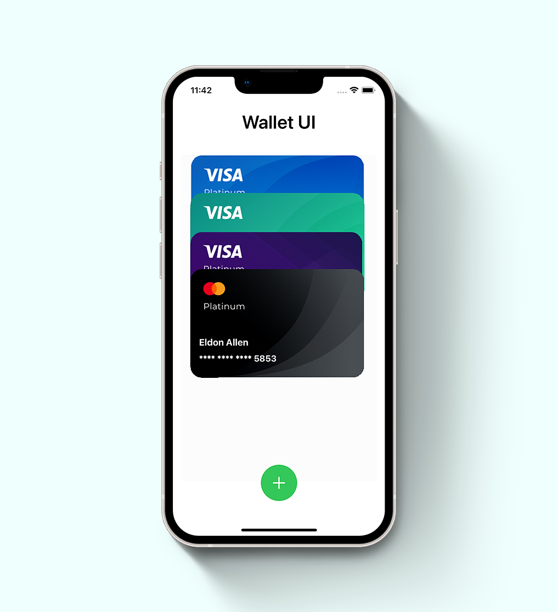
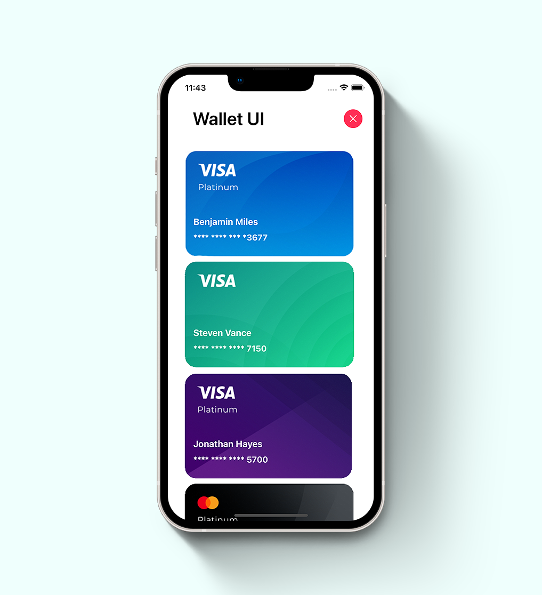
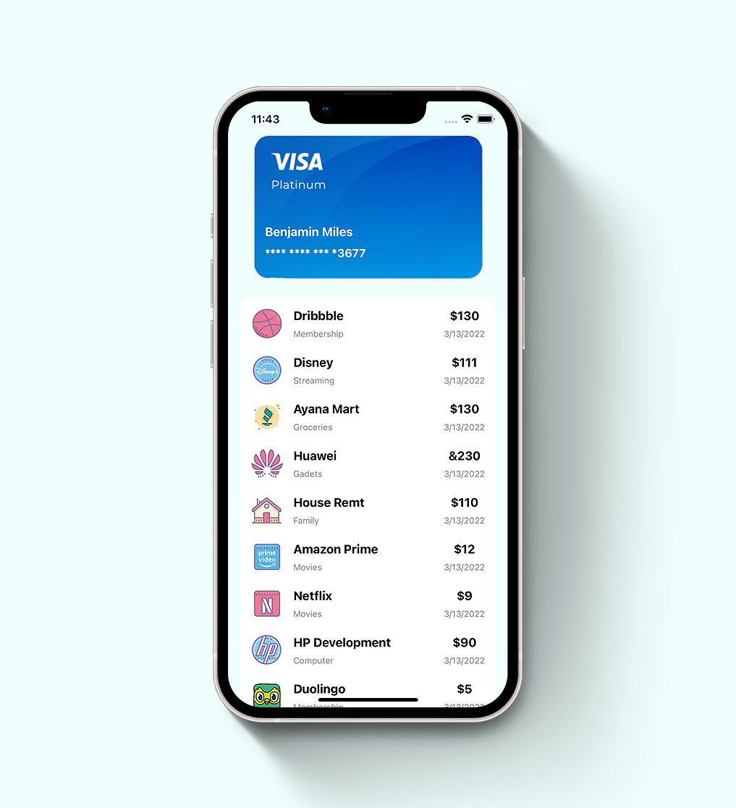
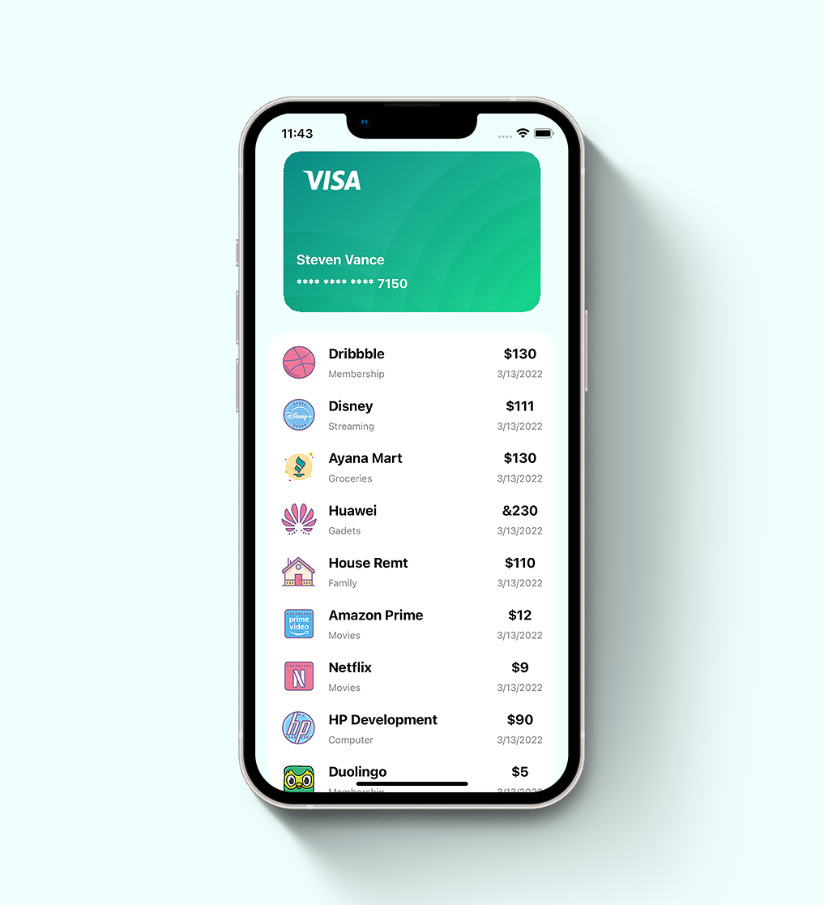

# iOS Wallet App UI

Wallet App UI with custom Animation using SwiftUI 3.0 for educational purposes.

[](https://opensource.org/licenses/Apache-2.0)
[](https://github.com/shameemreza/uray/blob/main/LICENSE)

## Video Preview

[](https://youtu.be/UB6681d0cfs "Wallet App UI")

## Screenshots







## Features

* SwiftUI Animation Challenge
* SwiftUI Delay Animations
* SwiftUI Delay List Animation
* SwiftUI Geometry Reader
* SwiftUI Matched Geometry Effect
* SwiftUI Overlay
* SwiftUI for iOS 15

Thanks: 😍

* [Animation Challenge by Balaji Venkatesh](https://kavsoft.dev)


## License

```
Copyright 2022 Shameem Reza

Licensed under the Apache License, Version 2.0 (the "License");
you may not use this file except in compliance with the License.
You may obtain a copy of the License at

   http://www.apache.org/licenses/LICENSE-2.0

Unless required by applicable law or agreed to in writing, software
distributed under the License is distributed on an "AS IS" BASIS,
WITHOUT WARRANTIES OR CONDITIONS OF ANY KIND, either express or implied.
See the License for the specific language governing permissions and
limitations under the License.
```
